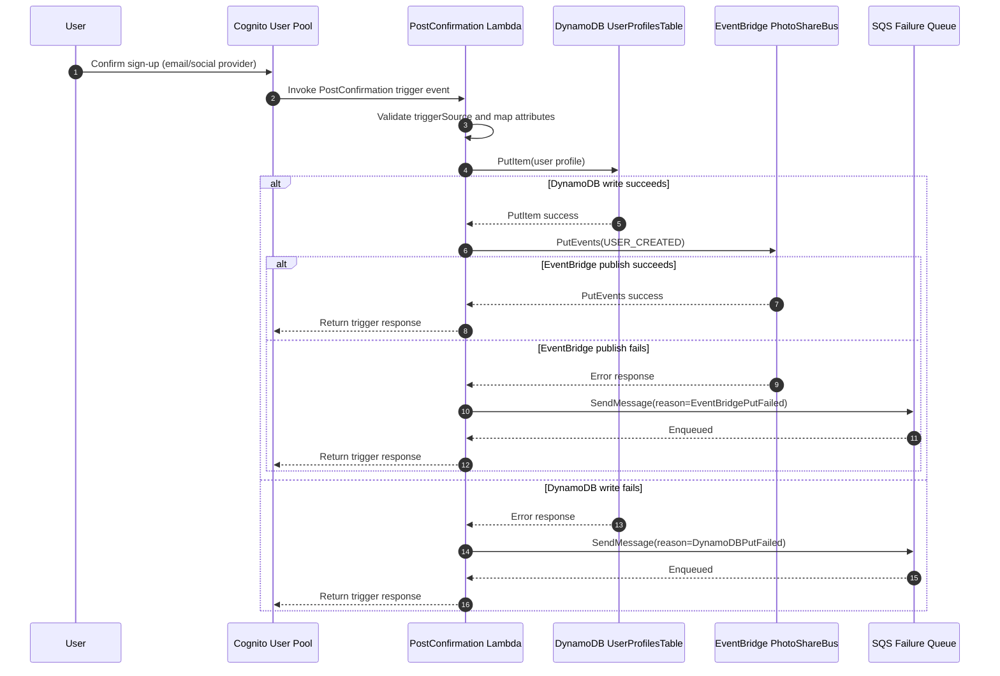

# User Microservice Architecture Design

## 1) System Overview and Service Boundaries

The User Microservice in the PhotoShare ecosystem owns user identity confirmation side effects and the canonical profile record for downstream services. It is triggered by Cognito post-confirmation events and writes a normalized user profile into DynamoDB, then publishes a `USER_CREATED` domain event to EventBridge.

### In scope
- Cognito User Pool and PostConfirmation trigger integration.
- Lambda-based post-confirmation processing.
- DynamoDB profile persistence.
- EventBridge publication for domain event fan-out.
- SQS failure queue for asynchronous remediation when write/publish fails.

### Out of scope
- Downstream consumer processing of `USER_CREATED`.
- Frontend Hosted UI implementation details.
- Replay/repair worker implementation for SQS failures.

## 2) Component Breakdown

### Amazon Cognito
- Acts as the identity provider and emits post-confirmation trigger invocations.
- Supplies verified user attributes (`sub`, `email`, optional `name`) to Lambda.
- Trust boundary: external identity traffic enters through Cognito; only validated trigger events are accepted by the microservice.

### AWS Lambda (`PostConfirmationFunction`)
- Entry point for post-confirmation processing.
- Validates trigger source and maps Cognito attributes into a domain profile.
- Coordinates persistence, event publication, and failure fallback to SQS.
- Runtime uses environment variables for table name, bus name, queue URL, and event metadata.

### Amazon DynamoDB (`UserProfilesTable`)
- Stores canonical user profile (`userId` partition key).
- Enabled with point-in-time recovery and server-side encryption.
- Current write operation is `PutItem` via DocumentClient.

### Amazon EventBridge (`PhotoShareBus`)
- Receives `USER_CREATED` events from Lambda.
- Decouples user lifecycle producers from downstream domain consumers.
- Event envelope metadata:
  - `source`: `photoshare.users`
  - `detail-type`: `USER_CREATED`

### Amazon SQS (`UserProfileWriteFailuresQueue`)
- Receives failure records when DynamoDB write or EventBridge publish fails.
- Persists recoverable operational failures for later replay/remediation.
- Contains structured payload with reason, user identity, trigger source, and error details.

## 3) Sequence Flow



## 4) USER_CREATED Event Contract

### Event envelope (EventBridge)

- `source`: `photoshare.users`
- `detail-type`: `USER_CREATED`
- `eventBusName`: `PhotoShareBus`

### JSON Schema (`detail` payload)

```json
{
  "$schema": "https://json-schema.org/draft/2020-12/schema",
  "$id": "https://photoshare.example/schemas/user-created/1.0.json",
  "title": "USER_CREATED",
  "type": "object",
  "additionalProperties": false,
  "required": ["userId", "email", "name", "createdAt"],
  "properties": {
    "userId": {
      "type": "string",
      "minLength": 1,
      "description": "Stable user identifier from Cognito sub."
    },
    "email": {
      "type": "string",
      "format": "email",
      "description": "Primary verified email address."
    },
    "name": {
      "type": "string",
      "minLength": 1,
      "description": "Display name at creation time."
    },
    "createdAt": {
      "type": "string",
      "format": "date-time",
      "description": "ISO-8601 timestamp when profile record is created."
    },
    "schemaVersion": {
      "type": "string",
      "const": "1.0",
      "description": "Optional explicit schema version when emitted."
    }
  }
}
```

### Example event `detail`

```json
{
  "userId": "a9f72c7d-1f23-4c0a-8a97-6d8e6b4dfb11",
  "email": "user@example.com",
  "name": "Example User",
  "createdAt": "2026-05-04T14:30:45.231Z",
  "schemaVersion": "1.0"
}
```

## 5) Security Posture and Least-Privilege IAM

The microservice follows least privilege by granting only write actions required for its execution path:

### Permission model by component

- **Lambda execution role**
  - `dynamodb:PutItem` on only the `UserProfilesTable` ARN.
  - `events:PutEvents` on only the `PhotoShareBus` ARN.
  - `sqs:SendMessage` on only the `UserProfileWriteFailuresQueue` ARN (via SAM SQS policy template).
  - No wildcard resources for data plane writes.

- **Cognito invocation permission**
  - `lambda:InvokeFunction` granted to principal `cognito-idp.amazonaws.com`.
  - Scoped with `SourceArn` equal to the specific User Pool ARN.
  - Prevents arbitrary invoke from unrelated services.

### Trust boundaries
- Boundary 1: External identity actions terminate at Cognito.
- Boundary 2: Cognito-to-Lambda trigger is controlled via explicit Lambda resource policy.
- Boundary 3: Lambda can only write to dedicated table, bus, and queue resources in this stack.

### Data protection controls
- DynamoDB server-side encryption enabled.
- SQS managed encryption enabled.
- DynamoDB point-in-time recovery enabled for profile durability.
- Failures are captured in queue messages with operational metadata for secure replay workflows.

## 6) Spec-Driven Traceability

The architecture is implemented and documented from explicit requirements:

- **System boundaries requirement** -> Covered in Sections 1 and 2.
- **Flow with DynamoDB failure to SQS DLQ path** -> Covered in Section 3 Mermaid diagram.
- **`USER_CREATED` contract requirement** -> Covered in Section 4 schema and sample payload.
- **Least-privilege security requirement** -> Covered in Section 5 IAM and trust boundary notes.
- **Simple professional language requirement** -> Document uses concise implementation-focused phrasing.

## 7) Backend-First Rollout Alignment

This design document is the foundation for a backend-first expansion into the broader Advitigudagudi platform:

- Current implementation focus remains Auth/User reliability and event contract stability.
- Next backend services consume the same Auth primitives and event bus:
  - `photo-service` will consume `USER_CREATED` and publish `PHOTO_SHARED`.
  - `calendar-service` will consume `USER_CREATED` and publish `MEETING_SCHEDULED` and `MEETING_STARTED`.
- Shared non-functional standards across services:
  - least-privilege IAM roles per service
  - consistent structured logs
  - idempotent writes and explicit failure capture via SQS
  - versioned REST APIs (`/v1/...`) and consistent error envelope
